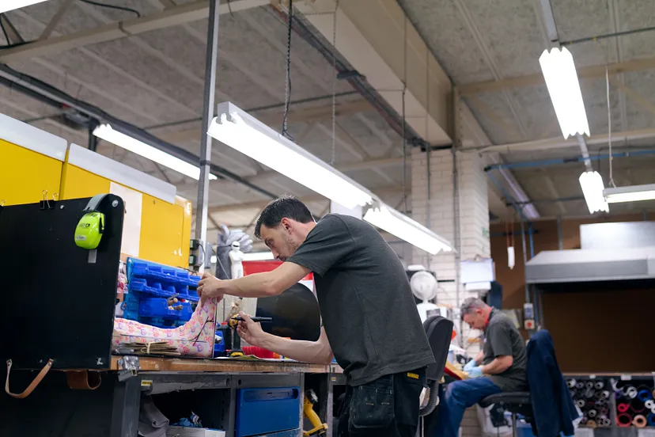

# AN ANOMALY DETECTION METHODOLOGY IN INDUSTRIAL PROCESSES

(image  by ThisisEngineering RAEng on Unsplash)

This article is derived from my bachelor’s thesis in Industrial Engineering titled “production data analysis with Data Science techniques”.
My thesis comes from the real industrial world, so I could use real industrial data, creating a case study useful for my thesis. This case study resulted in an anomaly detection in industrial processes.

## The main ideas behind this project
If you are not "a technician" or if you just want to understand the main concepts without reading the code, you can take a look at the PDF I created:
- [here](https://github.com/federico-trotta/Anomaly_detection_industrial_processes/blob/main/PDF/ITALIAN/Anomaly%20Detection%20nei%20Processi%20Industriali%20(tesi%20Laurea).pdf) you find the Italian version
- [here](https://github.com/federico-trotta/Anomaly_detection_industrial_processes/blob/main/PDF/ENGLISH/Anomaly%20Detection%20in%20Industrial%20processes.pdf) you find the English version

If you want a deeper understanding of the work I made, you can read:
- The article I published for [Towards Data Science](https://towardsdatascience.com/how-to-use-data-science-in-industrial-production-environments-6accf24afeb2).
- The publication on [Research Gate](https://www.researchgate.net/publication/374470763_Operators-based_Anomaly_Detection_In_Lean_Manufacturing_Assembly_Lines)

## About Federico Trotta

Hi, my name is Federico Trotta and I am a freelance Technical Writer.

Do you want to collaborate with me? [Contact me to hire me](https://bio.link/federicotrotta)!